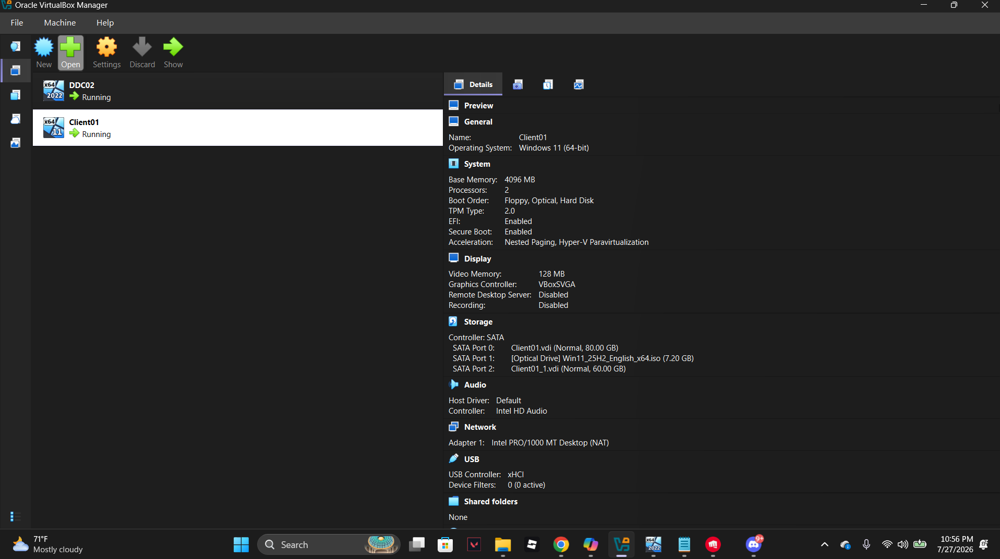

# Phase 1: VirtualBox Installation & ISO Setup

## What I did
- Installed Oracle VirtualBox (free, from virtualbox.org) on host machine (32GB RAM)
- Confirmed virtualization (VT-x/AMD-V) was enabled via Task Manager → Performance → CPU
- Downloaded Windows Server 2022 Evaluation ISO (Standard, Desktop Experience) from the Microsoft Evaluation Center
- Used an existing Windows 11 25H2 (x64) ISO from a prior personal project for the client VM, after verifying it was a genuine, complete Windows installation image

## Why I made these choices

**Why VirtualBox:**
Free, widely used virtualization software that supports running multiple VMs simultaneously — needed to run a server and a client VM at the same time on one host machine.

**Why check virtualization support first:**
AD labs require running a Server VM and a client VM simultaneously. Without CPU virtualization support enabled in the BIOS, VirtualBox cannot run 64-bit guest operating systems properly, so confirming this up front avoided a blocker later.

**Why Server 2022 Evaluation with Desktop Experience:**
The Evaluation edition is free for 180 days, sufficient for a lab environment. Desktop Experience (rather than Server Core) was chosen so the graphical interface, Server Manager, and wizards would be available while learning Active Directory concepts for the first time.

**Why reuse an existing Windows 11 ISO instead of downloading a new one:**
Verified the existing ISO was a genuine, untouched Windows installation image (correct internal folder structure: boot, efi, sources, support, bootmgr, setup.exe) before reusing it, avoiding an unnecessary redundant download.

## Screenshots

**Both VMs created in VirtualBox (DC02 and CLIENT01):**

## Problems I ran into
None — this phase was straightforward setup and downloads.
