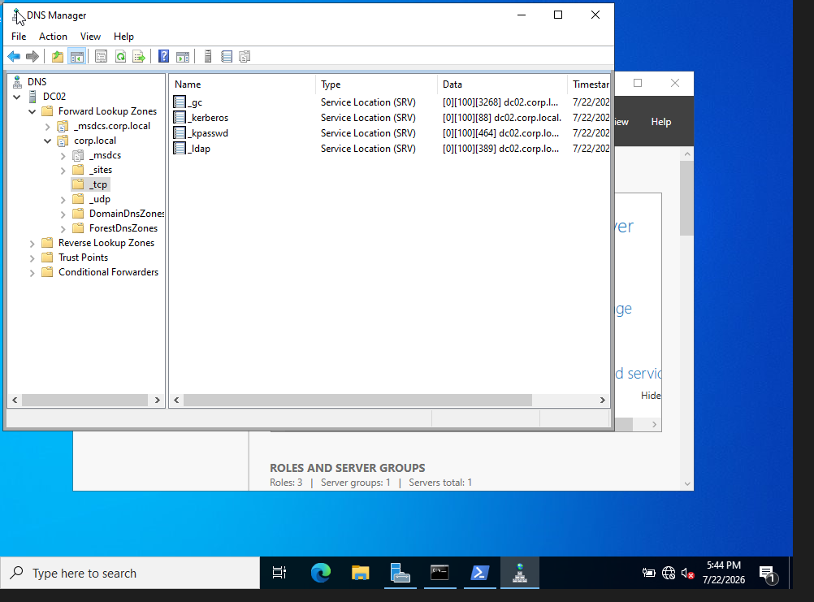

# Phase 3: AD DS Installation & Domain Controller Promotion

## What I did
- Renamed computer from default name to "DC02" (before promotion, to avoid post-promotion renaming complications)
- Configured static IP: 192.168.56.10, subnet mask 255.255.255.0, no gateway (Host-Only network), DNS set to itself
- Installed Active Directory Domain Services (AD DS) role via Server Manager → Add Roles and Features
- Promoted server to Domain Controller via AD DS Configuration Wizard:
  - Selected "Add a new forest"
  - Root domain name: corp.local
  - Left DNS delegation unchecked (no parent zone exists for a new forest root)
  - Set DSRM (Directory Services Restore Mode) password, separate from Administrator password
  - Accepted default NetBIOS name (CORP), default database/log/SYSVOL paths
  - Reviewed and passed prerequisites check (2 expected warnings, both informational)
  - Server rebooted automatically to complete promotion
- Verified promotion success:
  - Ran `Get-ADDomain` in PowerShell — returned valid domain info confirming DC status
  - Verified DNS SRV records manually in DNS Manager (Forward Lookup Zones → corp.local → _tcp → _ldap present)

## Why I made these choices

**Why static IP before promotion:**
I chose a static IP because if the IP were automatically configured it would be bound to change. Having a static IP keeps everything the same, so attempts to reach the DC use the same IP as always.

**Why rename the computer before promotion:**
I made sure to rename the computer before going further because a PC's name is woven into many different AD components once configured as a DC. If I waited until after to change the name, it would cause everything else to have to update in sync, which would create a lot of room for failure.

**Why "Add a new forest" instead of other deployment options:**
I used "Add a new forest" instead of the other two deployment options because this is the first DC on this network. The other two options are only viable if you already have a DC to add on to. Since this was created from scratch, there was no prior forest to add to or upgrade.

**Why corp.local instead of a real public-style domain:**
I used .local instead of .com or another real-style suffix because .local remains private. If I used a real public domain, there's a chance a real website exists with the same name, causing both names to take priority in different contexts and creating confusion.

**Why DNS delegation was left unchecked:**
Delegation was left unchecked because corp.local is a standalone root. Delegation would only make sense if I had a DNS zone above or below this one (such as it.corp.local as a child of corp.local), but since corp.local is its own standalone root, there was nothing to delegate.

## Screenshots

**_ldap SRV record confirmed in DNS Manager:**

## Problems I ran into

**1. nslookup returned "non-existent domain" despite the DC being correctly promoted**
- What happened: Ran `nslookup -type=SRV _ldap._tcp.corp.local`, got a non-existent domain (NXDOMAIN) error.
- Investigation: Checked `ipconfig /all` — DNS server was set to 127.0.0.1 (loopback), which is valid/expected for a machine acting as its own DNS server. Opened DNS Manager directly instead and manually verified the `_ldap` SRV record existed under corp.local → _tcp — confirmed the record genuinely existed.
- Root cause: nslookup is an older tool that can sometimes be inconsistent, occasionally not reflecting the actual DNS resolution path being used by the rest of the system.
- Lesson: When using diagnostic tools, keep in mind they can have inconsistencies or limitations — always cross-check against a direct, authoritative source (like DNS Manager) before assuming something is actually broken.

## Key takeaways
Seeing the actual SRV record in DNS Manager confirmed my configuration was correct, even though nslookup incorrectly suggested the DNS path wasn't working — a good reminder that tools can be wrong even when the underlying setup is right. I learned to use "Add a new forest" instead of adding to or upgrading an existing one, since this domain was built entirely from scratch with nothing pre-existing to add onto. I also learned to leave DNS delegation unchecked for the same reason — since corp.local is a standalone root with no parent or child zone, there was nothing to delegate.
