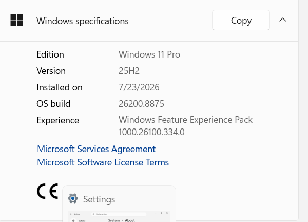

# Phase 4: Client VM Creation (CLIENT01)

## What I did
- Created new VM "CLIENT01": Windows 11 (64-bit), 4096MB RAM, 2 CPUs, 60GB dynamically allocated VDI
- Selected Windows 11 **Pro** edition during setup
- Configured Network Adapter 1 as Host-Only Network (same network as DC02)
- Installed Windows 11 via Setup, working through the Microsoft account sign-in requirement to reach local account creation

## Why I made these choices

**Why Windows 11 Pro instead of Home:**
Windows 11 Home does not support domain joining — that capability is restricted to Pro and above. Since this client machine needed to join corp.local, Pro was required.

**Why Host-Only Network (same as DC02):**
CLIENT01 needed to be on the same network as DC02 so it could later locate and authenticate against the DC, consistent with the same reasoning used when setting up DC02's network adapter.

## Screenshots

**Windows 11 Pro edition confirmation:**

## Problems I ran into

**1. Leftover 80GB disk shown alongside the new 60GB disk during install**
- What happened: Windows Setup's disk selection screen showed two disks — an unfamiliar default 80GB disk and the intended new 60GB disk.
- Root cause: The default disk VirtualBox pre-filled during VM creation wasn't removed before also creating the intended 60GB disk, leaving both attached to the VM.
- Fix: Selected the correct 60GB disk for installation; planned to remove the unused 80GB disk afterward via VM Settings → Storage to avoid wasted space and future confusion.

**2. Windows 11 setup forced a Microsoft account sign-in with no visible way to skip**
- What happened: Setup repeatedly pushed to the "Let's add your Microsoft account" screen with no obvious local/offline account option.
- Attempted fixes (in order):
  - Disabled the VM's network adapter to force an offline setup path — did not work, since the adapter was later found to still be enabled
  - Used `Shift+F10` to open a hidden command prompt during setup and ran `OOBE\BYPASSNRO` — command was accepted and the VM restarted, but it returned to the beginning of OOBE (region/keyboard) rather than skipping to a local account option
  - Attempted `taskkill /f /im oobenetworkconnectionflow.exe` to force the network-check process to fail — command was not found on this build
- What actually worked: Entered a fake, non-existent email and password on the Microsoft sign-in screen and let the sign-in attempt fail. This dropped setup into local account creation, using the fake email text as a cosmetic display name for the resulting local account (no real Microsoft account or authentication was involved).

## Lesson
When a built-in bypass method doesn't behave as documented (registry bypass, process termination), the underlying assumption behind it may not hold in every environment — in this case, the network adapter was never actually disconnected, which explains why the "no internet" bypass paths didn't trigger as expected. A more brute-force approach (deliberately failing sign-in) proved more reliable than the "intended" bypass methods.

## Key takeaway
I learned that built-in bypass methods (like the `OOBE\BYPASSNRO` registry trick) don't always work as expected — in my case, it didn't get me past the Microsoft account requirement. What actually worked was entering a fake email and letting the sign-in fail, which dropped setup into local account creation instead. It taught me that sometimes the simplest approach (letting something fail on its own) is more reliable than a documented workaround.
