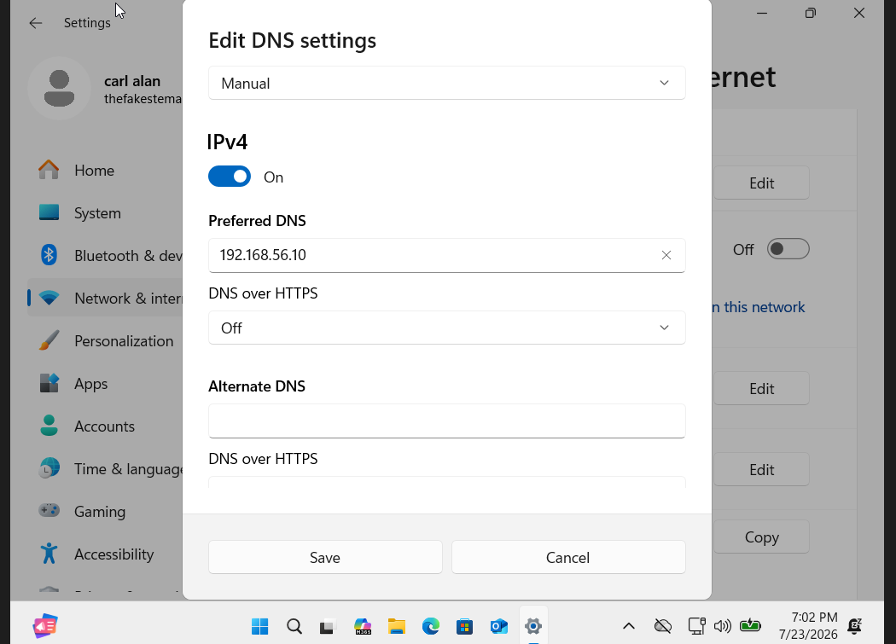
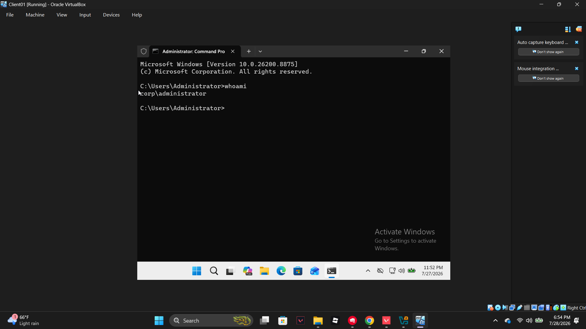

# Phase 5: Domain Join

## What I did
- Confirmed network connectivity between CLIENT01 and DC02 via ping (after discovering DC02 wasn't running)
- Set CLIENT01's DNS server manually to 192.168.56.10 (DC02's IP)
- Joined CLIENT01 to the corp.local domain via System Properties → Change → Domain
- Restarted, logged in as CORP\Administrator to verify domain authentication

## Problems I ran into

**1. Initial ping to DC02 failed (0/4 packets received)**
- What happened: Ran `ping 192.168.56.10` from CLIENT01 and got no replies.
- Investigation: Confirmed CLIENT01's own network config was correct, then checked whether DC02 was actually running.
- Root cause: DC02 simply wasn't powered on.
- Fix: Started DC02, re-ran the ping, connectivity succeeded (0 packets lost).

## Screenshots

**CLIENT01 DNS manually pointed to DC02:**

**Signing in to CLIENT01 as a domain account (CORP\Administrator):**

**Domain authentication confirmed via whoami (run on CLIENT01):**

## Key takeaway
Successfully pinging and then joining the domain confirmed why every earlier configuration choice mattered. The DC's static IP meant it was always reachable at the same address, and setting CLIENT01's preferred DNS to that same address meant it could actually locate the DC. Seeing the domain join succeed — and then logging in as CORP\Administrator — proved that the DNS-to-authentication chain was actually working, not just theoretical.
