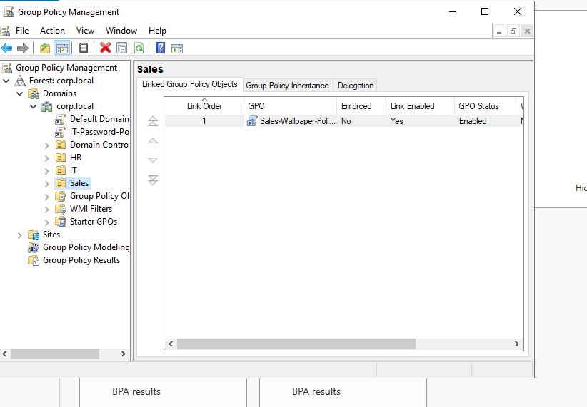
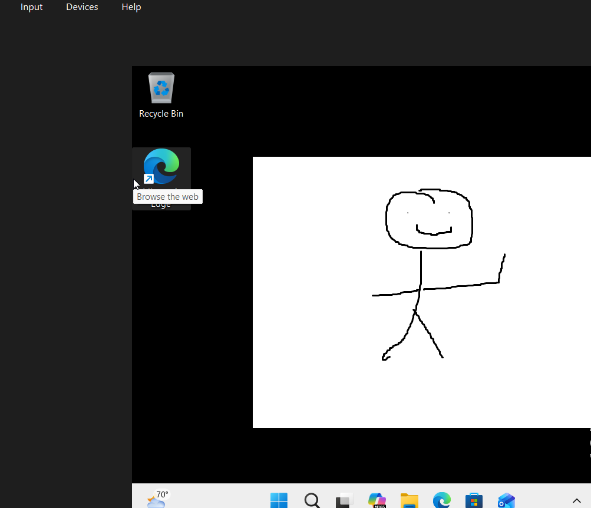

# Phase 7: Group Policy — Desktop Wallpaper (Sales OU)

## What I did
- Created a shared folder (`C:\Wallpapers`) on DC02, shared it as `\\DC02\Wallpapers` with Read access for Everyone
- Created a GPO (`Sales-Wallpaper-Policy`) linked to the Sales OU
- Configured the "Desktop Wallpaper" setting under User Configuration → Administrative Templates → Desktop, pointing to `\\DC02\Wallpapers\wallpaper.png`
- Logged into CLIENT01 as a Sales OU user, ran `gpupdate /force` to apply the policy
- Verified with `gpresult /r` that the policy was assigned, then confirmed visually that the wallpaper changed on the desktop

## Screenshots

**GPO linked to Sales OU:**

**Wallpaper applied on CLIENT01 desktop:**

## Problems I ran into

**1. Ambiguous restart prompt after gpupdate /force**
- What happened: After running `gpupdate /force`, the tool indicated a restart was needed, but no restart visibly occurred.
- Fix: Used `gpresult /r` to directly verify policy assignment instead of relying on the ambiguous restart message. Confirmed the policy was applied, and the wallpaper change was visible on the desktop shortly after.

## Key takeaway
Seeing the wallpaper actually change confirmed that GPOs linked to a specific OU apply automatically to the accounts inside it, without needing manual configuration on each individual machine. This tied together everything from earlier phases — the client needed correct DNS/domain join to even recognize the policy, and the shared folder needed proper network permissions for the client to actually retrieve the file. It showed how AD, DNS, GPOs, and file sharing all work together as one connected system, not separate isolated pieces.
